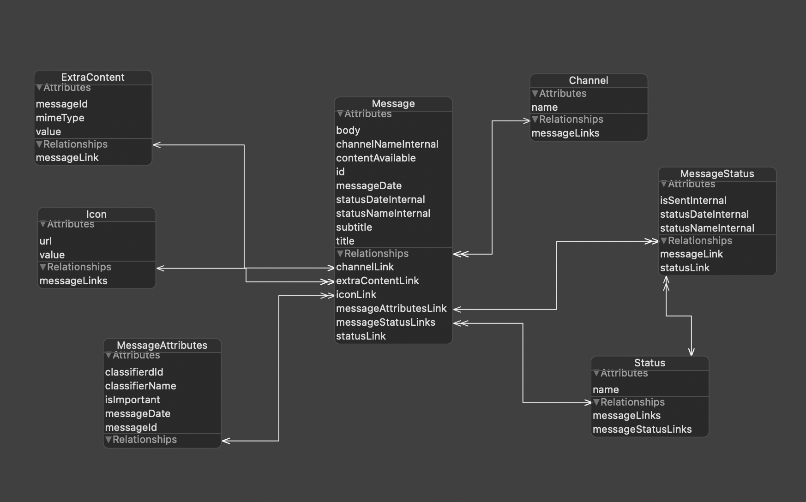

# Wings Push SDK для iOS
## Интеграция с приложением
### Настройки приложения:
 - минимальная версия (iOS Depoloyment Target: 10.0)
 - Сapabilities:
    - Для основного приложения:
        - Push notifications: ON
        - Background Modes: Remote Notifications
        - KeyChain Sharing: <Ваш Bundle Identifier> или <имя на ваш выбор>
        - App Group: group.<Ваш Bundle Identifier>

    

    - Для Service Content Extension:
        - KeyChain Sharing: <Ваш Bundle Identifier> или <имя на ваш выбор>
        - App Group: group.<Ваш Bundle Identifier>

    

- info.plist
    - если планируется отправлять запросы по протоколу http, то необходимо добавить в файлы info.plist (как в основном приложении, так и в extension) настройку:

    

### Добавление зависимости в проект:

1.  Через cocoapods

SDK добавляется через pod зависимость, как в основное приложение, так и в extension

```
platform :ios, '10.0'
source 'https://bitbucket.org/wings-solutions/push-sdk-podspec.git'
source 'https://github.com/CocoaPods/Specs.git'

target 'NotificationContentService' do
  # Comment the next line if you don't want to use dynamic frameworks
  use_frameworks!

  # Pods for NotificationContentService
  pod 'WingsPushSDK', '~> 2.0'
end
target 'PushApp' do
  # Comment the next line if you don't want to use dynamic frameworks
  use_frameworks!

  # Pods for PushApp
  pod 'WingsPushSDK', '~> 2.3'
end
```

2.  Путем добавления в проект файла WingsPushSDK.xcframework
    
3.  Через Swift Package Manager

```
https://github.com/wingssoft/WingsPushSdkiOS_SPM.git
```

## Использование:
В данном примере Wings Push Server расположен по адресу: `http://myserver.com:8080/myservice`. Для доступа исплользуются логин: `demologin`, пароль: `demopassword`. LogServer расположен по адресу: `http://mylogserver.com:8090/saveLogFile`

1. Импорт

    ```
    import WingsPushSDK
    ```

1. Инициализация
    Инициализация объекта `WingsPushSDK` происходит вызовом статического метода:

    ```
    try PushSDK.createInstance(
        identifier: identifier, sharedAppGroup: applicationGroup,
        pushServerParams: ServerParams(protocolType: protocolType, serverURL: serverURL, serverPort: Int(serverPort) ?? 8090, context: context),
        login: "demologin", password: "demopassword",
        logServerParams: ServerParams(protocolType: "http", serverURL: "mylogserver.com", serverPort: 8090, context: "saveLogFile")
    )
    ```
   , где
   - `identifier` - это sharing keychain (на скриншотах "mykeychain")
   - `sharedAppGroup` - это "group.<Ваш Bundle Identifier>" (на скриншотах "group.ru.wsoft.PushApp")

1. Получение объекта инстанса `WingsPushSDK`:

    ```
    let sdk = try PushSDK.getInstance(identifier: identifier, settingsReceivers: [mySettingReceiver], headerManager: myHeaderManager)
    ```
    , где
    - `identifier` - это sharing keychain (на скриншотах "mykeychain")
    - `settingsReceivers` - массив объектов, которые реализуют протокол `SettingReceiver`.
        * `SettingReceiver` - протокол предназначен для предоставления WingsPushSDK настроек, необходимых для работы.

            методы:
            * `func getProtocolType() -> String?`
            * `func getServerAddress() -> String?`
            * `func getServerPort() -> String?`
            * `func getServerContext() -> String?`
            * `func getServerLogin() -> String?`
            * `func getServerPassword() -> String?`
            * `func getLogServerProtocolType() -> String?`
            * `func getLogServerAddress() -> String?`
            * `func getLogServerPort() -> String?`
            * `func getLogServerContext() -> String?`
            * `func getSharedAppGroup() -> String?`
            * `func getSilenceDuplicates() -> String?`
            * `func getClientId() -> String?`
            * `func getDeviceId() -> String?`
            * `func getToken() -> String?`

    - `headerManager`- объект класса, который реализует протокол `HttpRequestAdditionalHeaderManager`
        * `HttpRequestAdditionalHeaderManager` - протокол, который нужен для добавления дополнительных заголовков в HTTP запросы, которые делаются к Wings Push API.

            методы:
            * `func getAdditionalHeaders(requestUri: String) -> [String:String]`

                на вход принимает uri запроса в виде строки (возможные значения для `requestUri` можно посмотреть в enum `ApiMethods`). В качестве результата возвращает Dictionary (key - имя заголовка, value - значение заголовка).

1. Подписка на получение уведомлений:

    ```
    let sdk = try PushSDK.getInstance(identifier: identifier, settingsReceivers: [mySettingReceiver], headerManager: myHeaderManager)
    if let sdk = sdk {
        sdk.subscribe(deviceId: deviceId, clientId: clientId, token: token) {(response: BaseApiResult?) -> () in
            if let response = response {
                if response.getResultKind() == .success {
                    //on success
                } else {
                    //on error
                    print("Error on subscribe: \(response.getErrorCode()): \(String(describing: response.getErrorDescription()))")
                }
            }
        }
    }
    ```
    , где
    - `deviceId` - идентификатор устройства
    - `clientId` - идентификатор клиента
    - `token` - токен устройства, полученный от облака

1. Получение сохраненного токена

    ```
    let sdk = try PushSDK.getInstance(identifier: identifier, settingsReceivers: [mySettingReceiver], headerManager: myHeaderManager)
    if let sdk = sdk {
        let savedToken = sdk.getSavedToken()
    }
    ```

1. Изменение токена на устройстве

    если токен устройства изменился, то нужно его обновить на сервере Wings Push Server, вызывав метод:

    ```
    let sdk = try PushSDK.getInstance(identifier: identifier, settingsReceivers: [mySettingReceiver], headerManager: myHeaderManager)
    if let sdk = sdk {
        sdk.updateSubscription(token: newToken) {(response: BaseApiResult?) -> () in
            if let response = response {
                if response.getResultKind() == .success {
                    //on success
                } else {
                    //on error
                    print("Error on subscribe: \(response.getErrorCode()): \(String(describing: response.getErrorDescription()))")
                }
            }
        }
    }
    ```
    , где 
    - `token` - новый токен, полученный от облака

    таким образом метод `application:didRegisterForRemoteNotificationsWithDeviceToken:` может выглядеть следующим образом:

    ```
    func application(_ application: UIApplication, didRegisterForRemoteNotificationsWithDeviceToken deviceToken: Data){
        let tokenParts = deviceToken.map {data in String(format: "%02.2hhx", data)}
        let token = tokenParts.joined()
        do {
            let sdk = try PushSDK.getInstance(identifier: identifier, settingsReceivers: [mySettingReceiver], headerManager: myHeaderManager)
            if let sdk = sdk {
                let savedToken = sdk.getSavedToken()
                if let savedToken = savedToken {
                    if savedToken != token {
                        sdk.updateSubscription(token: token) {(response: BaseApiResult?) in
                            if let response = response {
                                if response.getResultKind() == .success {
                                    //on success
                                } else {
                                    //on error
                                    print("Error on subscribe: \(response.getErrorCode()): \(String(describing: response.getErrorDescription()))")
                                }
                            }
                        }
                    }
                } else {
                    sdk.subscribe(deviceId: deviceId, clientId: clientId, token: token) {(response: BaseApiResult?) -> () in
                        if let response = response {
                            if response.getResultKind() == .success {
                                //on success
                            } else {
                                //on error
                                print("Error on subscribe: \(response.getErrorCode()): \(String(describing: response.getErrorDescription()))")
                            }
                        }
                    }
                }
            }
        } catch {
            print("Some error was occurred: \(error)")
        }
    }
    ```

1. Получение уведомления

    для обработки получения уведомления у `WingsPushSDK` есть 2 метода:

    * `public func onMessageReceive(_ request: UNNotificationRequest, with defaultAddress: String? = nil, postCompleted : @escaping (_ response: BaseApiResult?, _ error: Error?, _ bestAttemptContent: UNMutableNotificationContent?) -> ())`

        метод предназаначен для использования внутри Notification Content Service'а, в методе `didReceive(_:withContentHandler:)`
        например:
        
        ```
        override func didReceive(_ request: UNNotificationRequest, withContentHandler contentHandler: @escaping (UNNotificationContent) -> Void) {
            ...
            let sdk = try PushSDK.getInstance(identifier: identifier, settingsReceivers: [mySettingReceiver], headerManager: myHeaderManager)
            if let sdk = sdk {
                sdk.onMessageReceive(request, with: defaultAddress, postCompleted: { (response: BaseApiResult?, error: Error?, bestAttemptContent: UNMutableNotificationContent?) in
                    if let bestAttemptContent = bestAttemptContent {
                        //process result of request 
                        ...
                        contentHandler(bestAttemptContent)
                    }
                })
            } else {
                //process request...
            }
            ...
        }
        ```

    * `public func onMessageReceive(messageId: String, title: String? = nil, subtitle: String? = nil, body: String? = nil, with defaultAddress: String? = nil, postCompleted : @escaping (_ response: BaseApiResult?) -> ()) throws`

        метод используется, если вы сами хотите парсить payload уведомления. В этом случае необходимо передать в `messageId` значение атрибута "message-id" из объекта userInfo

    #### Примечание: оба метода могут принимать параметр `with defaultAddress` - это "<deviceId>.<clientId>". Если приложение не выполнило метод subscribe, но при этом получает уведомления, то у приложения будет возможность отправить статус о доставке уведомления с этим адресом по умолчанию. Если приложение выполнило метод subscribe, то этот параметр будет игнорироваться.

    *     

    #### Примеры:
    * Если вы используете didReceiveRemoteNotification для получения уведомлений (не рекомендуется для отправки статусов обычных уведомлений и рекомендуется для отправки статусов silent пушей)
        ```
        func application(_ application: UIApplication, didReceiveRemoteNotification userInfo: [AnyHashable : Any], fetchCompletionHandler completionHandler: @escaping (UIBackgroundFetchResult) -> Void) {
            let sdk = try PushSDK.getInstance(identifier: identifier, settingsReceivers: [mySettingReceiver], headerManager: myHeaderManager)
            if let sdk = sdk {
                let messageId = userInfo["message-id"]
                if let messageId = messageId {
                    sdk.onMessageReceive(messageId: messageId) {(response: BaseApiResult?) -> () in }
                }
            }
        }
        ```

    * Если вы используете Notification Content Service (рекомендуется)

        ```
        override func didReceive(_ request: UNNotificationRequest, withContentHandler contentHandler: @escaping (UNNotificationContent) -> Void) {
            let sdk = try PushSDK.getInstance(identifier: identifier, settingsReceivers: [mySettingReceiver], headerManager: myHeaderManager)
            if let sdk = sdk {
                sdk.onMessageReceive(request) { (response: BaseApiResult?, error: Error?, bestAttemptContent: UNMutableNotificationContent?) in
                    if let bestAttemptContent = bestAttemptContent {
                        //process response/error, modify bestAttemptContent
                        contentHandler(bestAttemptContent)
                    }
                }
            } else {
                //process request without sdk
            }
        }
        ```

        **ВАЖНО:** выполнять метод contentHandler внутри postCompleted, а не вне его.

1. Прочтение уведомления

    Также как и с получением, предусмотрено 2 метода:

    * `public func onMessageRead(didReceive response: UNNotificationResponse, postCompleted : @escaping (_ response: BaseApiResult?) -> ()) throws`

        предназначен для использования внутри метода `userNotificationCenter(_:didReceive:withCompletionHandler:)`

        ```
        func userNotificationCenter(_ center: UNUserNotificationCenter, didReceive response: UNNotificationResponse, withCompletionHandler completionHandler: @escaping () -> Void) {
            let sdk = try PushSDK.getInstance(identifier: identifier, settingsReceivers: [mySettingReceiver], headerManager: myHeaderManager)
            if let sdk = sdk {
                sdk.onMessageRead(messageId: messageId, postCompleted: { (response: BaseApiResult?) in
                    if let response = response {
                        if response.getResultKind() == .success {
                            //on success
                        } else {
                            //on error
                            print("Error on subscribe: \(response.getErrorCode()): \(String(describing: response.getErrorDescription()))")
                        }
                    }
                })
            }
            completionHandler()
        }
        ```

    * `public func onMessageRead(messageId: String, postCompleted : @escaping (_ response: BasicResponse?, _ error: ErrorResponse?) -> ())`

        тут аналогично методу получения: парсим payload, получаем messageId и вызывам метод PushSDK

1. Обновление параметров подписчика

    ```
    try sdk.updateSubscriber(updateAddress: nil, attributes: ["onlineAt": Date().description, "param": "p1"], postCompleted: { (response: BaseApiResult?) in
        //...
    })
    ```
    , где 
    - `updatedAddress` - адрес обновляемого устройства (либо nil, если это текущее устройство)
    - `attributes` - dictionary с атрибутами подписчика.

1. Получение параметров подписчика

    ```
    try sdk.getSubscriberData(rDeviceId: requestedAddress, postCompleted: {(response: SubscriberGetResult?) in
        if let result = result {
            if result.getResultKind() == .success {
                if let elements = result.getElements() {
                    for element in elements {
                        var attributes: String = ""
                        for (key, value) in (element.getAttributes() ?? [:]) {
                            attributes += "\(key): \(value ?? "nil"), "
                        }
                        if attributes.count > 0 {
                            attributes.removeLast(2)
                        }
                        print("Address: \(element.getAddress()), osType: \(element.getOsType() ?? "nil"), osVersion: \(element.getOsVersion() ?? "nil"), attributes:  \(attributes)")
                    }
                }
            } else {
                print("Error: \(result.getErrorCode()): \(result.getErrorDescription() ?? "nil")")
            }
        } else {
            print("response not found")
        }
    })
    ```
    , где 
    - `requestedDeviceAddress` - адрес запрашиваемого устройства (deviceId)

1. Отписаться от уведомлений

    ```
    try sdk.unsubscribe(note: note) {(response: BaseApiResult?) -> () in
        //...
    }
    ```
    , где 
    - `note` - причина отписки
    
1. Скачивание контента

    ```
    try sdk.downloadContent(messageId: messageId, postCompleted: { (response: ContentDownloadResult?) in
        if let result = result {
            if result.getResultKind() == .success {
                if let content = result.getContent() {
                    print(String(data: content, encoding: .utf8) ?? "content is not a string")   
                } else {
                    print("content not found")
                }
            } else {
                print("Error: \(result.getErrorCode()): \(result.getErrorDescription() ?? "nil")")
            }
        } else {
            print("response not found")
        }
    })
    ```
    , где
    - `messageId` - идентификатор сообщения
    
1. Отправка логов на LogServer
    ```
    sdk.sendLogs()
    ```

1. Модель локального хранилища

    
    
    * Получение атрибутов сообщения
    ```
    message.messageAttributesLink?.classifierdId
    message.messageAttributesLink?.messageDate
    message.messageAttributesLink?.messageId
    ```

1. Удаление сообщений из локального хранилища
    
    * Все сообщения
    ```
    sdk.removeAllMessages()
    ```

    * По идентификатору
    ```
    sdk.removeMessage(by: "someId")
    ```

    * По условию
    ```
    sdk.removeMessage(predicate: NSPredicate(format: "title == %@", filter))
    ```

1. Получение уведомлений

    * По идентификатору
    ```
    sdk.getMessageById(id: "someId") { (messageById) in
        if let message = messageById {
        ...
        }
    }
    ```
    
    * По условию
    ```
    sdk.getMessageByPredicate(predicate: NSPredicate(format: "title == %@", filter)) { (messagesController) in
        if let messages = messagesController {
        ...
        }
    }
    ```

    * Получение объекта NSFetchedResultsController<Message>
    ```
    sdk.getFetchedResultsController()
    ```
